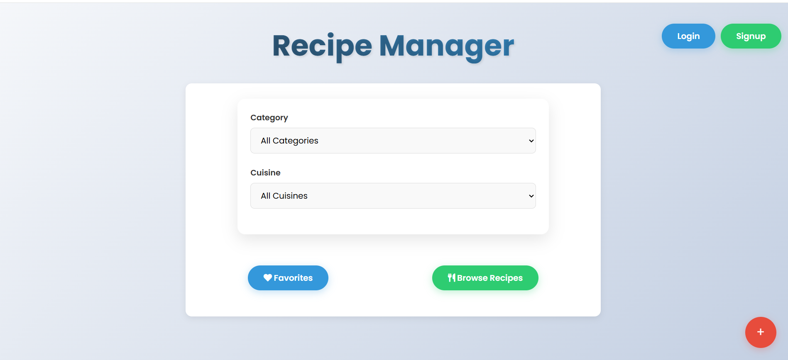
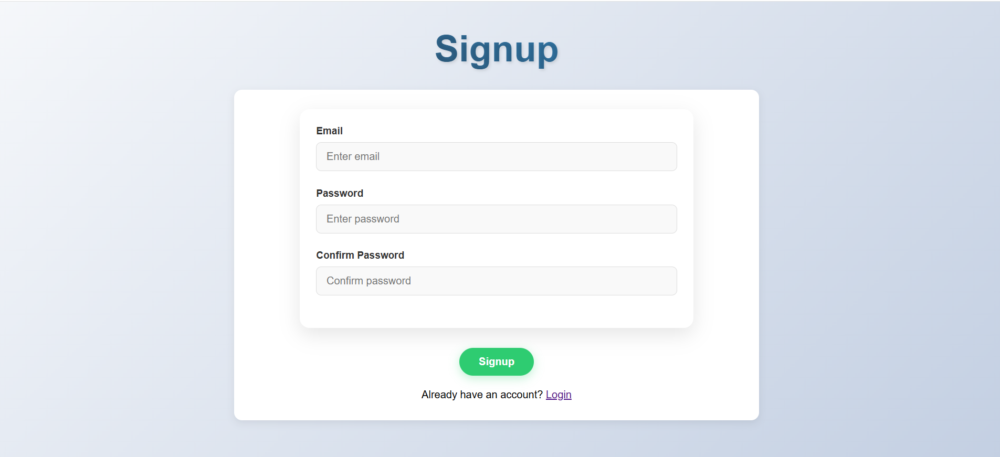
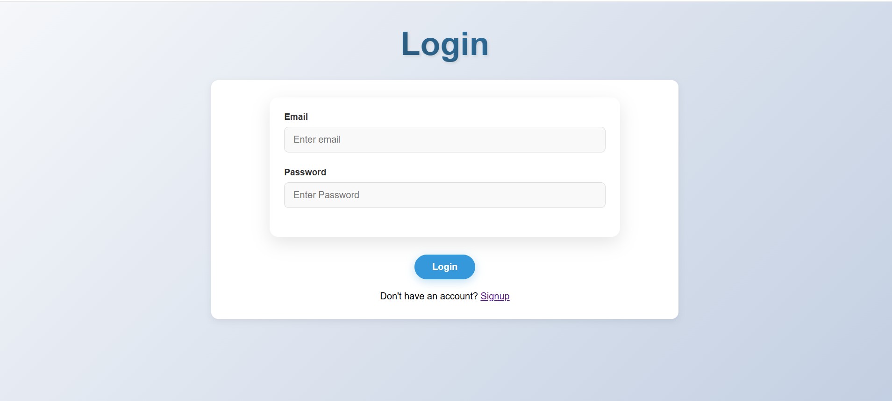
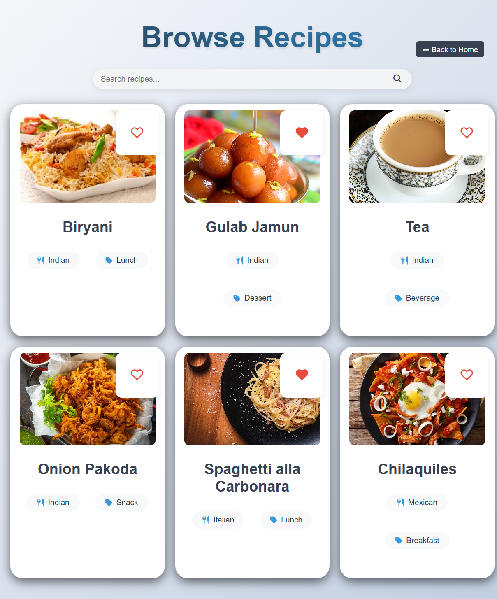
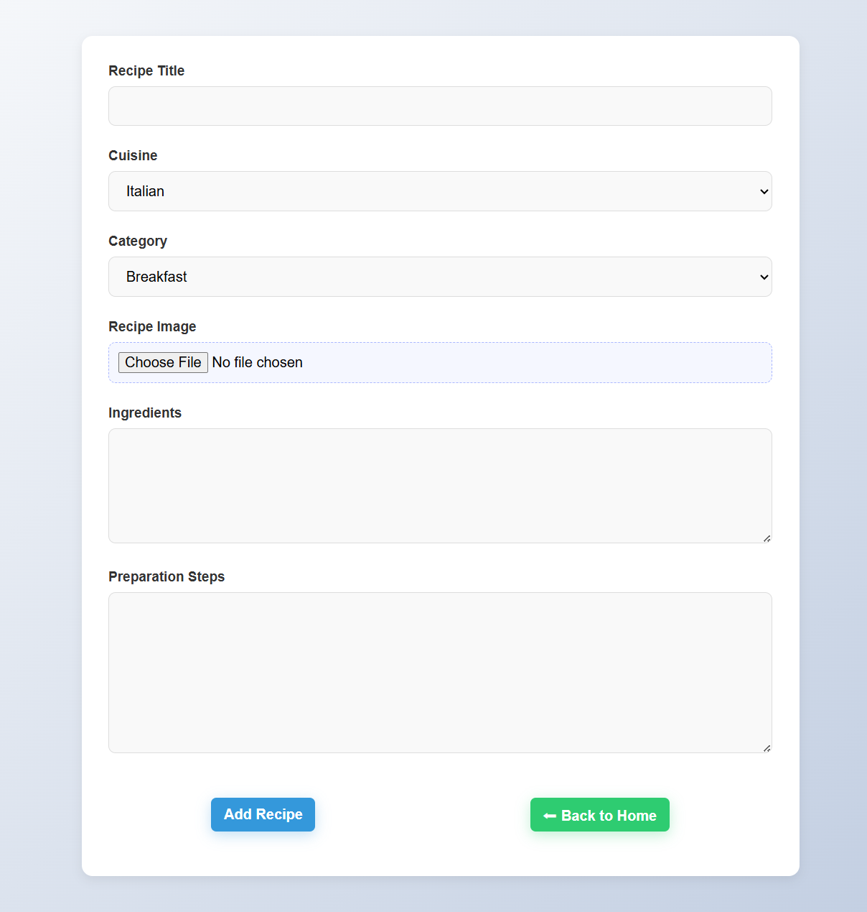
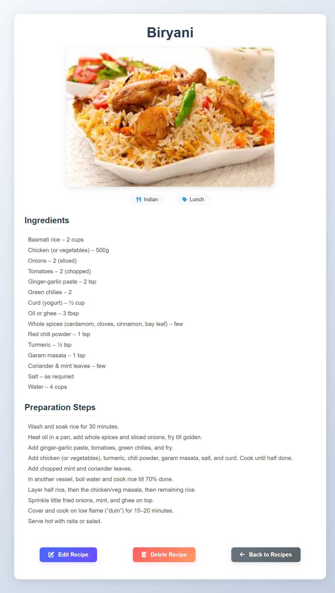
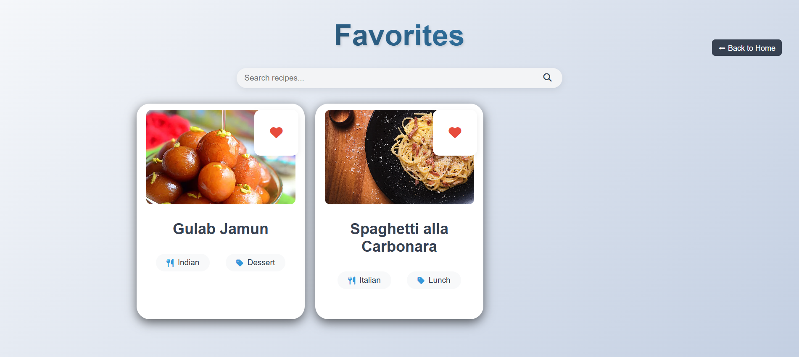

# Recipe Manager 🍲

Recipe Manager is a web application that allows users to add, browse, and manage cooking recipes in an organized way. Users can create accounts, add recipes, search for recipes, and manage their personal recipe collection through a simple interface.

The application is built using **Python Flask**, **HTML**, **CSS**, and **SQLite**.

---

## Features

* User signup and login
* Add new recipes
* Browse all recipes
* Search recipes
* View detailed recipe information
* Edit existing recipes
* Delete recipes
* Recipe categories
* Favorite recipes feature
* User profile management

---

## 🛠 Technologies Used

* Python
* Flask
* HTML
* CSS
* SQLite
* Jinja2 Templates

---

## Project Structure

```
Recipe_Manager
│
├── app.py              # Main Flask application
├── recipes.db          # SQLite database
│
├── static
│   └── style.css       # Application styling
│
└── templates
    ├── index.html      # Home page
    ├── browse.html     # Browse recipes
    ├── recipe.html     # Recipe details page
    ├── add.html        # Add new recipe
    ├── login.html      # User login page
    └── signup.html     # User registration page
```

---

##  Installation

### 1. Clone the repository

git clone https://github.com/yourusername/recipe-manager.git
cd recipe-manager

### 2. Install dependencies

pip install flask

### 3. Run the application

python app.py

### 4. Open the application

Open your browser and visit:

http://127.0.0.1:5000

---

## Usage

1. Create an account or login.
2. Add recipes with ingredients and cooking instructions.
3. Browse or search recipes.
4. Edit or delete recipes when needed.
5. Save recipes as favorites and manage them in your profile.

---

## License

This project is created for educational and learning purposes.

---

## Author

Developed as a Recipe Manager web application using Flask.

## 📸 Screenshots

### Home Page


### SignUp Page


### Login Page


### Browse Recipes


### Add Recipe


### Recipe Details


### View Favorite Recipes



